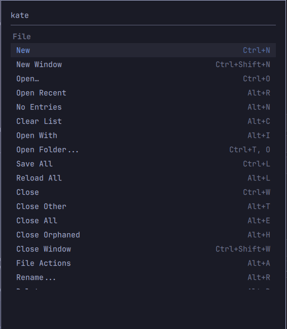
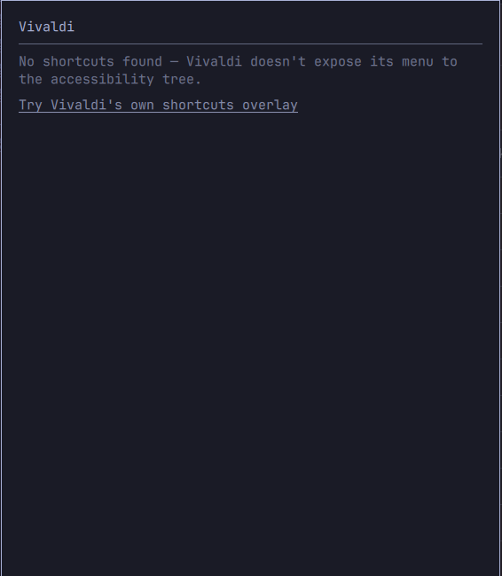
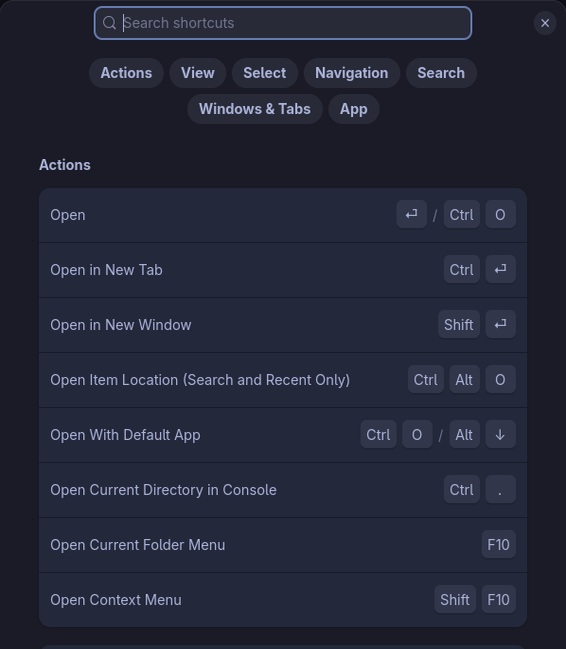

# kheetsheet-hypr

A Hyprland/Omarchy port of [kheetsheet](https://github.com/Doghouse-Mike/kheetsheet): press a hotkey, see the focused app's real keyboard shortcuts in an overlay, grouped by menu, pulled live from the app's own accessibility tree. Click one to run it.

Same idea, same underlying mechanism (AT-SPI - the same thing screen readers use), ported from KDE Plasma to Hyprland, packaged as an [Omarchy](https://omarchy.org) shell plugin instead of a KWin script + PyQt6 overlay.

| Real shortcuts, grouped by menu | No shortcuts exposed | Opt-in native-overlay fallback |
| --- | --- | --- |
|  |  |  |


## Install

```
git clone git@github.com:Doghouse-Mike/kheetsheet-hypr.git
cd kheetsheet-hypr
./install.sh
```

(No `git`, or prefer not to use it? Use GitHub's own "Download ZIP" button on this page instead, extract it, and `cd` into the extracted folder before running `./install.sh`.)

This installs the daemon as a systemd user service, copies the plugin into `~/.config/omarchy/plugins/`, and enables it in `~/.config/omarchy/shell.json`. It does **not** bind a hotkey - see the printed instructions at the end (no single default key is safe across every Omarchy install; two different "obvious" defaults were both already taken on the machine this was developed on).

**Installing via the Omarchy plugin marketplace instead?**

```
omarchy plugin add https://github.com/Doghouse-Mike/kheetsheet-hypr
```

This only clones this repo into `~/.config/omarchy/plugins/doghouse-mike.kheetsheet/` and enables the manifest - it does **not** run `install.sh`, so the backend daemon this plugin depends on won't be running yet and the overlay will always show "no shortcuts found." Run `install.sh` from inside that cloned directory (or from a separate clone of this repo) once, manually, to finish setup.

Test without a hotkey at all:

```
omarchy-shell shell toggle doghouse-mike.kheetsheet '{}'
```


## Status

Early / in development. The daemon and plugin both work end-to-end on the machine this was built and tested on (Omarchy 4.0.1, Hyprland 0.56.2) and a separate, definite "potato" class laptop running the same setup. Not yet packaged for general install beyond `install.sh`. See `HANDOVER.md` for full development history, decisions, and open items.

## How it's different from upstream

- **No KWin script.** Hyprland's active-window state is queried on demand via `hyprctl activewindow` at the moment the overlay opens, instead of being pushed continuously by a compositor script. Confirmed live that a Quickshell layer-shell overlay never shows up as Hyprland's "active window" even while it holds exclusive keyboard focus, so there's no race between the overlay opening and this query.
- **No PyQt6 / no Qt in the daemon at all.** The daemon is a pure D-Bus backend (AT-SPI + a GLib mainloop); the overlay itself is a native Omarchy Quickshell plugin (`manifest.json` + `Kheetsheet.qml`, at the repo root), which speaks `wlr-layer-shell` natively - no XWayland workaround needed (upstream needs one, because Qt-Wayland windows don't honour always-on-top/positioning under KWin).
- **D-Bus interface is pull-based**: `GetShortcuts() -> JSON` and `InvokeShortcut(index) -> bool`, called by the plugin's QML rather than the daemon pushing to its own in-process overlay.

The actual AT-SPI extraction logic (`daemon/kheetsheet_hyprd/service.py`) is ported near-verbatim from upstream - it was already 100% compositor-independent.


## Dependencies

- `python-gobject` + AT-SPI typelib (`at-spi2-core`)
- `python-dbus`
- `hyprctl` (part of Hyprland)
- `busctl` (part of systemd)
- `omarchy-shell` (part of Omarchy)
- `ydotool` + a running `ydotoold` - soft/optional, only needed for the opt-in native-overlay fallback

`install.sh` checks for all of these (the first four are hard requirements; `ydotool` is checked at runtime instead, since it's only needed if you actually use the fallback).

## Removal

```
systemctl --user disable --now kheetsheet-hypr-daemon.service
rm -f ~/.config/systemd/user/kheetsheet-hypr-daemon.service
systemctl --user daemon-reload
omarchy plugin remove doghouse-mike.kheetsheet
```

Then remove the `o.bind(...)` line you added for it from `~/.config/hypr/bindings.lua` and run `hyprctl reload`. Nothing else is touched: no other config files, no data written to disk, no lingering processes once the service is stopped.

## Usage

Press your bound hotkey to show the current app's shortcuts; press it again or hit Escape to dismiss. Type to filter. Click a shortcut (or arrow to it and press Enter) to run it directly, the same way upstream does: via AT-SPI's `Action` interface, not a simulated keypress.

## App compatibility

Largely identical to upstream - this is mostly a property of each app's toolkit and how much it exposes to the accessibility tree, not of the compositor. Confirmed directly on Hyprland during development:

- **Works well, via the normal AT-SPI menu path:** Qt/KDE Frameworks apps with a real menu bar (Okular, qBittorrent - both verified with real, complete shortcut lists including nested submenus). Also expected to work: Dolphin, Kate, Konsole, KCalc, Krita, LibreOffice, older GTK apps with a traditional menu bar (GIMP 2.x).
- **Works via the opt-in native-overlay fallback:** GNOME/libadwaita header-bar-only apps with their own `Ctrl+Shift+/` shortcuts dialog (Nautilus - verified). See "Native-overlay fallback" below - this only ever runs when the user explicitly asks for it from the empty state, never automatically.
- **Won't work at all:** Electron apps (Obsidian - verified: registers with AT-SPI but exposes nothing walkable even with Chromium's `--force-renderer-accessibility` flag forced on, tested live; same toolkit-level gap as upstream's finding for VS Code/Discord/Slack/Teams/Spotify). No fallback exists for these - see HANDOVER.md for what was tried.

Building an app and want it to show up here? See [COMPATIBILITY.md](COMPATIBILITY.md) for what kheetsheet actually looks for and how to add it, toolkit by toolkit.

## Native-overlay fallback (opt-in)

For apps with no exposed menu at all, the "no shortcuts found" state offers a link: "Try {app}'s own shortcuts overlay." Only if the user clicks it (or presses Enter on that empty state), the daemon:

1. Refocuses the app that was focused before the overlay opened.
2. Sends it a real synthetic `Ctrl+Shift+/` via `ydotool` (kernel-level `uinput` injection - **not** `wtype`/the Wayland virtual-keyboard protocol, which was tried first and turned out to be unreliable in practice: it worked once, then silently failed to trigger the same app's dialog on every retry afterward, across fresh app instances and varied timing. `ydotool` worked consistently on every attempt).

That's it - kheetsheet's own panel hides itself first (releasing the exclusive Wayland keyboard focus it normally holds, so the synthetic keypress actually reaches the target app instead of being swallowed here) and stays out of the way. Whatever native "Keyboard Shortcuts" dialog the app then shows is left on screen exactly as the app renders it - unthemed, in the app's own styling - for the user to read and close themselves. Kheetsheet does not scrape, parse, or re-render it; it only reopens itself if the attempt failed outright (e.g. `ydotool` missing, or the window couldn't be refocused), to report why.

This is the one piece of the whole project that injects real input rather than only reading AT-SPI passively, and it exists because [kheetsheet's own author already considered and rejected doing this automatically](https://28mm.coffee/the-reasoning-behind-kheetsheet) ("faking keypresses (creepy), performance hits, and weird vanishing window behaviour"). Making it explicit and user-triggered, and leaving the app's own dialog on screen rather than trying to fake it in this project's own styling, doesn't erase that reasoning - it's a different, smaller claim: *you* asked for this specific action, this once, and what you see afterward is honestly the app's own overlay, not kheetsheet's. Requires `ydotool` + a running `ydotoold` (soft dependency - checked at runtime, not required to install everything else). Also a practical benefit: because this app's own unthemed dialog looks visibly different from kheetsheet's own styled overlay, it's an easy visual tell for "this app has no AT-SPI menu support" versus "this app is fully supported."

## Architecture

- `daemon/kheetsheet_hyprd/service.py` - AT-SPI tree walk, GTK/Qt accelerator normalization, Flatpak pid-matching fallback. Ported from upstream, includes one fix found during porting: some apps (confirmed: Okular) register *two* AT-SPI application objects under the same pid, one real and one an empty stub, and which one gets enumerated first isn't controllable - the matcher now prefers whichever has children instead of returning on the first pid hit.
- `daemon/kheetsheet_hyprd/hypr.py` - synchronous `hyprctl -j activewindow` query.
- `daemon/kheetsheet_hyprd/native_overlay.py` - the opt-in fallback: Hyprland-Lua-API window focusing (`hl.dsp.window.cycle_next()` in a loop - there's no selector-based focus dispatcher in this Hyprland version's Lua API, reverse-engineered live, see HANDOVER.md) and the `ydotool`-based synthetic key send that triggers the app's own dialog. Nothing here reads or renders that dialog's contents.
- `daemon/kheetsheet_hyprd/__main__.py` - the D-Bus service (`com.kheetsheet.Daemon` at `/KheetSheet`, same bus name as upstream). `GetShortcuts`/`InvokeShortcut` mirror upstream's pull model; `TryNativeOverlay` is new, for the fallback above.
- `manifest.json` / `Kheetsheet.qml` (repo root) - the Omarchy Quickshell overlay plugin. Talks to the daemon via `busctl --json=short` (Quickshell has no generic D-Bus client QML type - only a special-purpose `DBusMenu` module), the same "shell out, parse JSON" idiom the `sinkeat.keysmith` plugin uses for its own helpers. Kept at the repo root (rather than nested under a plugin-id folder) so this repo satisfies the Omarchy plugin marketplace's "manifest.json at repository root" convention.
- `systemd/kheetsheet-hypr-daemon.service` - the installed user unit (template; `install.sh` fills in the real path).

## Privacy

Same as upstream for the normal path: no network calls, nothing written to disk, nothing retained once the overlay closes. See upstream's README for the full reasoning - it all still applies here unchanged.

The opt-in native-overlay fallback is the one deliberate exception, and it's still narrow: it sends one real keypress to the app that was already focused (nothing else) and leaves it to show its own dialog - kheetsheet never reads or retains anything from it. No network calls or disk writes happen there either. It only ever runs when explicitly triggered - see "Native-overlay fallback" above for the full reasoning on why this exists as opt-in rather than automatic.

## Credit

All of the actual shortcut-reading mechanism is [Doghouse-Mike/kheetsheet](https://github.com/Doghouse-Mike/kheetsheet). This is a port of that idea and that code to a different desktop, not a separate design.
